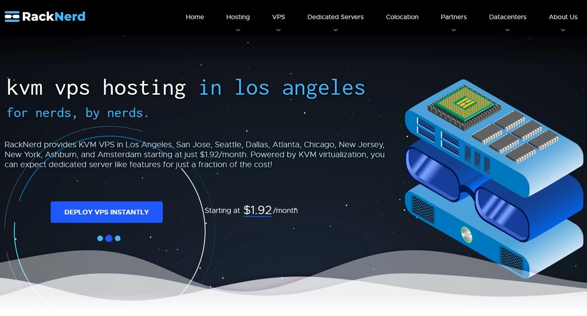
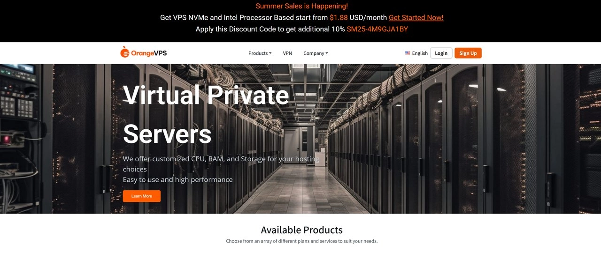
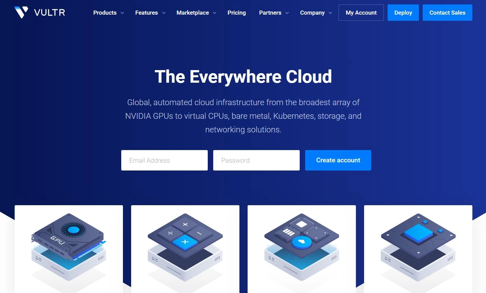

# Top Budget-Friendly US VPS Picks for 2025: Cheap, Reliable, and Worth Every Penny

---

Finding a solid US VPS doesn't mean settling for bottom-barrel quality or breaking the bank. Sure, those one-dollar-a-month deals look tempting, but most come with sky-high latency, random downtime, or worse—providers who disappear overnight. After years of testing different hosts, I've learned that **what we really need is value, not just low prices**.

Today I'm sharing the VPS providers I actually use and trust—ones my friends have been running for years without headaches. They all share one thing: **affordable pricing that doesn't compromise on reliability**.

---

# RackNerd - Rock-Bottom Pricing

When hunting for cheap US VPS options, RackNerd always comes up. First time I saw their pricing—$10 annually for 1 core, 1GB RAM, and SSD storage—I did a double-take. That's practically giving it away.

I'll admit I was skeptical at first. RackNerd had a rougher reputation in earlier years, with some user complaints floating around online. But **RackNerd has proven itself** over several years of stable operation. No sudden disappearing acts here.

Their network performance surprised me. The Los Angeles datacenter works best, with nationwide latency around 190ms—perfectly decent for running blogs or small projects.

Of course, budget VPS means budget limitations. RackNerd's pricing reflects what you get, so if you need top-tier performance and premium support, you'll want to look elsewhere. **You get what you pay for** still holds true.

Looking at their specs, the value proposition is clear. Entry-level plans cost under $11 annually—less than a dollar monthly—and all packages include SSD storage. Can't ask for much more at this price point.

If you're new to VPS or have modest requirements, RackNerd makes a solid starter choice. Just keep expectations realistic for the price tier.

---

# HostDare - Balancing Performance and Price

While RackNerd wins on pure pricing, HostDare strikes a nice balance between performance and affordability. I first noticed them because of their aggressive discount campaigns—up to 65% off.

HostDare's regular pricing sits at standard rates, but they release powerful promo codes. Their Cheap USA product line can hit 65% discounts, bringing SSD series packages down to the teens in dollars. That's when the value really shines.

Testing HostDare's performance gave me some pleasant surprises. CPU performance beats Vultr's shared CPU offerings in benchmarks. Memory and disk performance stay consistent, with NVMe drives delivering blazing read/write speeds.

Even better, HostDare offers China-optimized routing, including **return path optimization** via CN2, CU, and CMIN2. Costs more, but mainland users get noticeably better network experience. I won't dive deeper here—check HostDare's official site for details.

While pricing looks higher than RackNerd initially, don't forget those promo codes. Two standout discounts currently available:

- **Cheap VPS series**: Code SPRINGLA25 gives 65% off US Cheap VPS, making the SSD0 plan around $9 yearly
- **CN2-GIA optimized**: Code S6S013NYWI provides 35% off CN2-GIA routing products

After applying discounts, HostDare's value becomes exceptional. If performance matters to you but budget stays tight, HostDare hits that sweet middle ground.

For users who want reliable hosting without the premium price tag, exploring HostDare's optimized network options could be a game-changer. 👉 [Discover how affordable premium VPS performance can be](https://bandwagonhost.com/aff.php?aff=79616) when you choose the right provider with mainland-optimized routing.

---

# OrangeVPS - Fresh Face with Strong Value

OrangeVPS might be relatively new—only three years old—but their growth trajectory looks promising. Opening a Hong Kong datacenter this year shows they're expanding capabilities.

What caught my attention is their **VPS BUDGET (ALWAYS PROMO)** series—a permanent discount line. The name says it all: these are their value-focused products. **2 cores, 2GB RAM for $22.5 annually** competes directly with the previous providers. One catch: high demand means this series **sells out frequently**, so grab it when available.

Despite being newer, my experience shows stable service. Hardware specs look good too—Intel Xeon E5-2699 v4 processors with NVMe SSD storage for fast read/write performance.

Even their entry **BASIC-KCMO-1** plan delivers **2GB RAM + 1Gbps bandwidth + NVMe storage** for just **$38.40 yearly**—roughly **$3 monthly**. Finding this configuration-to-price ratio among competitors is rare.

Worth noting: the **BUDGET series offers permanent discounts** but **stocks out often** due to strong value. If budget constrains you but stable performance matters, OrangeVPS's budget line deserves consideration.

---

# DMIT - Strong Alternative to BandwagonHost

People often compare DMIT with BandwagonHost. Fair comparison—they target similar market positions.

From my experience, DMIT's biggest advantage is better value. Pricing comes in notably cheaper than BandwagonHost. But cheaper doesn't mean compromised performance—actual usage shows DMIT matching or occasionally exceeding performance in certain areas.

The main gap is probably brand recognition. BandwagonHost enjoys bigger name recognition domestically with more users. But purely from technical perspective, DMIT's service quality sits on par with BandwagonHost.

DMIT also offers mainland-optimized routing. Their Premium network uses CN2 GIA and similar optimized paths, keeping latency under 160ms. For users wanting better network experience, this choice has appeal.

Looking at pricing, DMIT takes a flexible approach. The cheapest WEE plan costs $36.9 annually—around $3 monthly—genuinely competitive. Plus when traffic runs out, DMIT throttles speed without shutting down service, which beats BandwagonHost's approach.

Starting from the TINY plan, monthly payment becomes available at $6.9, though configuration basically matches the annual WEE plan except double traffic. For users uncertain about long-term needs, monthly payment makes smarter sense.

Overall, if you're torn between BandwagonHost and DMIT, I'd lean toward DMIT first. Same configurations cost less, performance holds up, making it genuinely worth recommending.

---

# BandwagonHost - Synonym for Quality and Reputation

Discussing US VPS without mentioning BandwagonHost would be incomplete. I remember when I started exploring VPS—BandwagonHost offered $19 annual plans back then. True value king. Many people still treasure those VPS like family heirlooms.

Over recent years though, BandwagonHost increasingly prioritizes service quality. Network optimization, hardware upgrades, customer service improvements—progress across the board. Naturally, prices rose accordingly. Current cheapest Basic VPS runs $49 annually.

But I'll say this: BandwagonHost VPS quality genuinely excels, with outstanding stability and performance. Especially worth mentioning is their USCA_2 datacenter—while not premium routing, it offers mainland three-carrier direct connections with latency around 180ms (*regular LA datacenters hit 200ms*).

If budget allows, consider their CN2 GIA routing, dropping latency below 150ms, though at premium prices. I won't elaborate—check their official site if interested.

Configuration-wise, BandwagonHost's hardware specs stay solid. All use RAID-10 SSD storage with good CPU performance. While pricing exceeds the previous providers, BandwagonHost's brand reputation and service quality justify the premium.

BandwagonHost's biggest strength is reliability. Whether technical support, network stability, or data security, they handle things properly. If you want hassle-free, dependable VPS and don't mind paying extra, choosing BandwagonHost makes smart sense.

Of course, if budget limits you, the earlier providers all work well too. Key is matching your actual needs.

When network stability and reliable performance matter most for your projects, investing in proven quality pays off. 👉 [See why serious users choose BandwagonHost for mission-critical hosting](https://bandwagonhost.com/aff.php?aff=79616) with their industry-leading uptime and optimized infrastructure.

---

# Vultr - Top Choice for Flexible Billing

Vultr ranks among the more familiar US VPS providers for domestic users. Many friends use it—definitely well-known.

What attracts me most about Vultr is their diverse product lineup. Beyond standard shared and dedicated CPU options, they offer GPU instances, bare metal servers, and other premium products. Datacenters span globally with abundant choices. This diversified portfolio covers virtually any use case.

I use Vultr myself, mainly for project testing. Biggest advantage: **hourly billing**—pay only for what you use. Finish testing, delete the instance anytime without wasted money. Super convenient for temporary needs.

Vultr has some caveats though. With many domestic users, occasionally you'll encounter blocked IPs. So whenever creating VPS, I test IP accessibility first—it's become habit.

Pricing-wise, Vultr sits at standard rates. While cheapest option runs $3.5 monthly, configuration only includes: *1 core / 0.5GB RAM / 0.5TB*. Compared to the ultra-budget VPS covered earlier, definitely pricier.

Looking at specs, Vultr's value proposition lags considerably. Same money gets better configurations from previous providers. But Vultr's advantages lie in **brand recognition, product stability, and hourly billing flexibility**.

If you need temporary test environments or prioritize VPS stability over cost concerns, Vultr remains an excellent choice. Especially their hourly billing model proves genuinely useful for short-term usage.

---

# Other Notable US VPS Providers

The six VPS providers above all come from personal use or friends' long-term experience—overall satisfaction solid. But the US VPS market runs deep, with plenty of other providers offering unique features.

For instance, **DIYVM** provides unlimited traffic plans if you have high bandwidth needs. **InterServer** counts as an established provider with relatively stable service, suitable for users valuing brand history. There's also **Hostwinds**, whose cheapest managed VPS might suit less tech-savvy users needing maintenance help.

These providers target specific user groups with particular needs. I won't detail them here. If the previous six don't quite fit, browse these providers' official sites—you might discover products better matching your requirements.

---

# Frequently Asked Questions (FAQ)

**Q1: What payment methods do these VPS providers accept?**

Most providers support Alipay and PayPal, very convenient for domestic users. If concerned about fund security, prioritize PayPal payment—disputes through PayPal can protect your funds if issues arise.

**Q2: Can I get refunds after purchasing VPS?**

Most providers offer limited-period refund guarantees, typically 3-30 days. For example, BandwagonHost provides 30-day money-back guarantee, while Vultr's hourly billing allows deletion anytime. Refund policies vary by provider—register accounts first and confirm with customer service via ticket system before purchasing.

**Q3: Are these VPS suitable for website hosting?**

Absolutely. All VPS I've introduced support website hosting needs well, whether WordPress, static sites, or other CMS systems. For beginners, suggest choosing slightly higher-tier plans—starting from 2GB RAM—for better experience.

**Q4: How's the network speed on these VPS?**

For domestic users, Los Angeles datacenters typically work best, with regular VPS latency around 200ms. For better network experience, consider packages with CN2 or other mainland-optimized routing. Though pricier, latency can drop to 150ms.

**Q5: Do VPS purchases require real-name verification?**

US VPS providers don't require real-name verification—just email and payment information needed. This is one reason many choose US VPS: registration and usage stay straightforward.

**Q6: What if my VPS gets blocked?**

This indeed happens commonly. Contact customer service for IP replacement—most providers offer this service. Some may charge small fees (like BandwagonHost), others offer free changes (like DMIT providing limited free replacements).

**Q7: Which is more cost-effective: annual or monthly payment?**

Financially, annual payment definitely saves more—typically 15-30% in costs. But if uncertain about long-term usage or wanting trial periods first, monthly payment works fine too. Providers like Vultr with hourly billing prove especially friendly for testing needs.

**Q10: Can I switch VPS operating systems?**

Yes, VPS supports OS reinstallation—you can switch from Ubuntu to Debian, CentOS, etc., anytime. Note that reinstalling clears all data, so backup before proceeding.

---

# Conclusion

Finding the right US VPS comes down to balancing budget with needs. Whether you choose ultra-budget options like RackNerd and OrangeVPS, balanced performers like HostDare and DMIT, or premium reliability from BandwagonHost, each provider serves different scenarios. For testing flexibility, Vultr's hourly billing can't be beat. The key takeaway: **cheap doesn't mean compromised if you choose providers with proven track records**. Match your project requirements to the right provider, and you'll get reliable performance without overspending. For users seeking that perfect middle ground of affordability and mainland-optimized connectivity, exploring providers with CN2 routing options 👉 [can deliver the premium experience your projects deserve](https://bandwagonhost.com/aff.php?aff=79616) without the premium price tag of traditional enterprise solutions.
